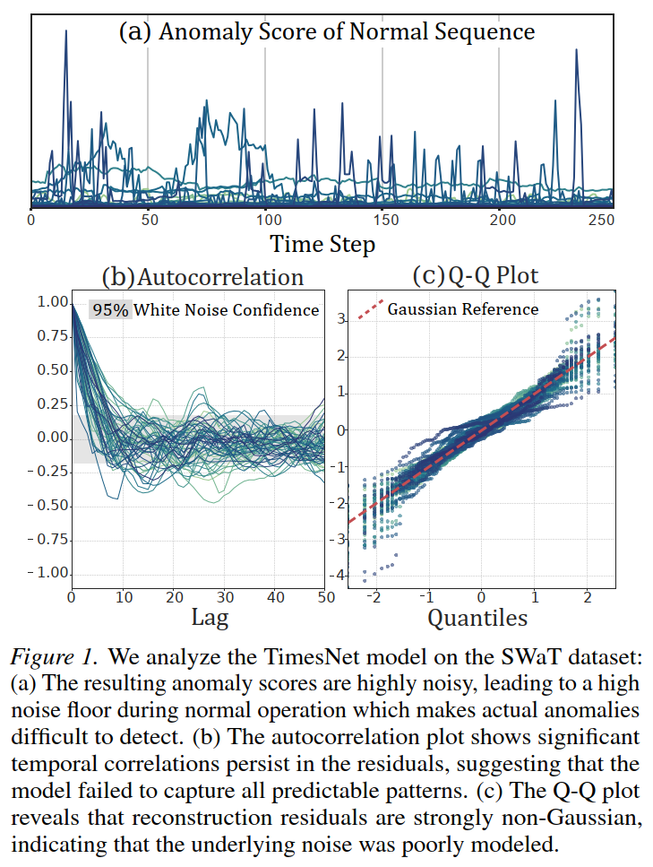
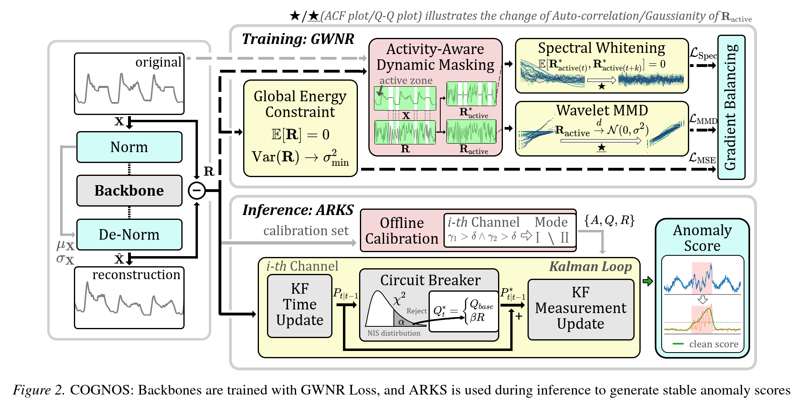
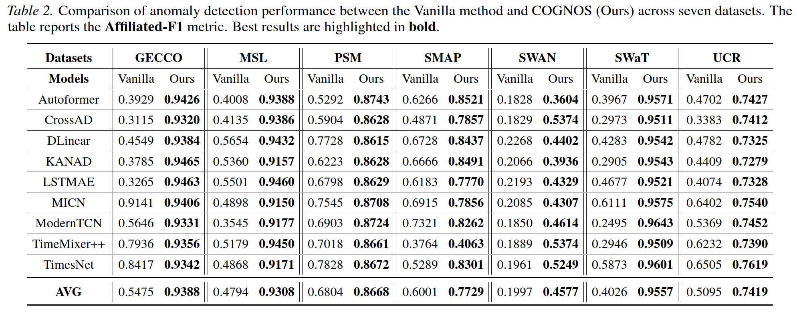
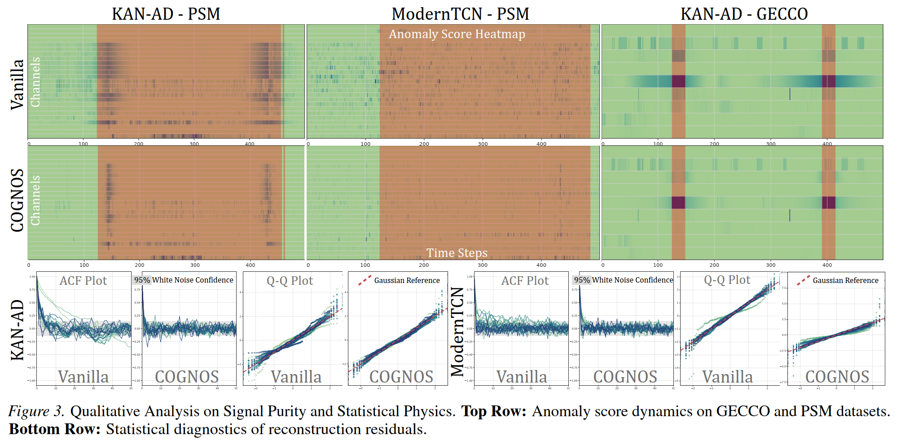

# COGNOS: Universal Enhancement for Time Series Anomaly Detection

[](https://arxiv.org/abs/2511.06894)
[](./requirements.txt)
[](./requirements.txt)

COGNOS is a model-agnostic enhancement framework for reconstruction-based time series anomaly detection. It was accepted at **ICML 2026** and is designed to improve existing backbones by aligning reconstruction residuals with a more statistically sound anomaly-scoring pipeline.

This repository contains the research code and the LaTeX source for the paper:

**COGNOS: Universal Enhancement for Time Series Anomaly Detection via Constrained Gaussian-Noise Optimization and Smoothing**

## Highlights

- **Universal**: works with many reconstruction-based backbones.
- **Statistically grounded**: introduces Gaussian-White-Noise Regularization (GWNR) to shape residuals.
- **Robust scoring**: applies an Adaptive Residual Kalman Smoother (ARKS) for denoised anomaly scores.
- **Broad gains**: evaluated on multiple benchmarks including `MSL`, `SMAP`, `PSM`, `SWAN`, `SWaT`, `GECCO`, and `UCR`.

## Why COGNOS?

Most reconstruction-based TSAD pipelines use Mean Squared Error (MSE) both for training and anomaly scoring. In practice, this often produces residuals that are:

- temporally correlated,
- non-Gaussian,
- noisy and unstable as anomaly scores.

COGNOS improves this pipeline by explicitly engineering the residuals to better match the statistical assumptions required by reliable downstream scoring and smoothing.



## Core Idea

Most reconstruction-based TSAD methods optimize MSE, but their residuals are often noisy, correlated, and non-Gaussian. COGNOS addresses this mismatch with two components:

1. **GWNR Loss**: encourages residuals to behave like Gaussian white noise during training.
2. **ARKS**: uses the learned residual statistics to produce more stable anomaly scores at inference.

In other words, COGNOS does not replace your anomaly detection backbone. It upgrades the training objective and the residual post-processing pipeline.



## Supported Backbones

- `Autoformer`
- `CrossAD`
- `DLinear`
- `KANAD`
- `LSTMAE`
- `MICN`
- `ModernTCN`
- `TimeMixer++`
- `TimesNet`

## Benchmarks

- `GECCO`
- `MSL`
- `PSM`
- `SMAP`
- `SWAN`
- `SWaT`
- `UCR`

## Main Results

COGNOS improves the average **Affiliation-F1** over vanilla training on every reported benchmark:



## Qualitative Results

COGNOS produces cleaner residual statistics and more stable anomaly scores, helping suppress noisy fluctuations in normal regions while preserving true anomaly responses.




## Repository Structure

```text
.
- data_provider/
- exp/
- layers/
- models/
- scripts/
- utils/
- run.py
- requirements.txt
```

## Quick Start

### 1. Install dependencies

```bash
pip install -r requirements.txt
```

### 2. Prepare data

Download the preprocessed datasets and place them under `./dataset`.

- <https://drive.google.com/file/d/1iIZlBG77AlVLmZS1qupd6D_XIWnUkgin/view?usp=sharing>

### 3. Run an experiment

Example:

```bash
bash ./scripts/anomaly_detection/PSM/TimesNet.sh
```

The experiment scripts for different datasets and backbones are organized under `./scripts/anomaly_detection/`.

To enable the COGNOS pipeline, use the options below in the training script:

```bash
--use_KalmanSmoothing
--KF_confidence <value>
--use_Gaussian_regularization
```

## Results

Experiment outputs are saved as `result_anomaly_detection.csv`.

Typical run tags:

- `..._GRTrue_itr0_Kalman_` for COGNOS
- `..._GRFalse_itr0_Vanilla_` for the vanilla baseline

Reported metrics include:

- `Precision`
- `Recall`
- `F-score`
- `Aff_precision`
- `Aff_recall`
- `Aff_F_score`
- `AUC_ROC`
- `AUC_PR`
- `R_AUC_ROC`
- `R_AUC_PR`

## Citation

If you find this work useful, please cite:

```bibtex
@inproceedings{Shangcognos2026,
  title={{COGNOS}: Universal Enhancement for Time Series Anomaly Detection via Constrained Gaussian-Noise Optimization and Smoothing},
  author={Shang, Wenlong and Tian, Shihao and Wan, Xutong and Chang, Peng},
  booktitle={International Conference on Machine Learning (ICML)},
  year={2026}
}
```

## Acknowledgement

This library is constructed based on the following repos:

- Time-Series-Library: <https://github.com/thuml/Time-Series-Library>

- CrossAD: <https://github.com/decisionintelligence/CrossAD>

- ModernTCN: <https://github.com/luodhhh/ModernTCN>

- TODS: <https://github.com/datamllab/tods>

- Affiliation metrics: <https://github.com/ahstat/affiliation-metrics-py>
